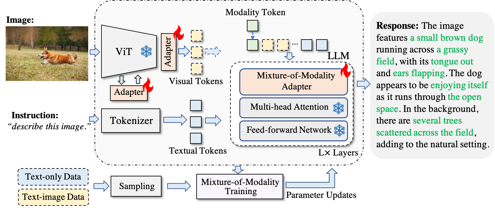
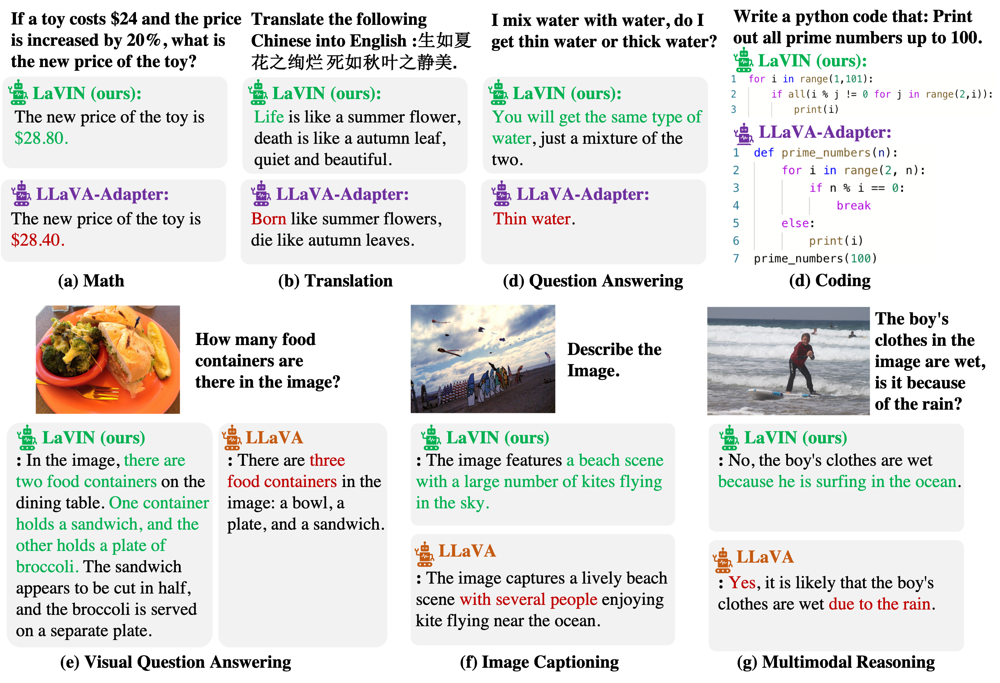

# LaVIN

---

This repository contains the implementation of the following paper:
> **Cheap and Quick: Efficient Vision-Language Instruction Tuning for Large Language Models** [[Project Page]]() [[Paper]](https://arxiv.org/abs/2304.04269)  <br>
> [Gen Luo](https://luogen1996.github.io)<sup>1</sup>, [Tianhe Ren](https://rentainhe.github.io)<sup>1</sup>, Yiyi Zhou<sup>12</sup>, Shengxin Chen<sup>1</sup>, [Xiaoshuai Sun](https://sites.google.com/view/xssun)<sup>12</sup>, [Rongrong Ji](https://mac.xmu.edu.cn/rrji/)<sup>12</sup><br>
<sup>1</sup>Media Analytics and Computing Lab, Department of Artificial Intelligence, School of Informatics, Xiamen University  
> <sup>2</sup>Institute of Artificial Intelligence, Xiamen University 
>
In this work, we propose a novel and affordable solution for vision-language instruction tuning, namely Mixture-of-Modality Adaptation (MMA). 
Particularly, MMA is an end-to-end optimization regime, which connects the image encoder  and LLM via lightweight adapters.   Meanwhile, we also   propose a novel routing algorithm in MMA, which can   help the model automatically shifts the  reasoning paths  for single- and multi-modal instructions.  Based on MMA, we develop a large vision-language instructed model called LaVIN, which demonstrates superior training efficiency and  better reasoning ability  than existing multimodal LLMs in various instruction-following tasks.
---

<div  align="center">    

</div>

## News 
- **`2023/05/17`**: 🔥We released the code of  **LaVIN: Large Vision-Language Instructed model**, which achieves 89.4 (LaVIN-7B) and 90.8 (LaVIN-13B)  accuracy on ScienceQA! 🔥With the proposed **mixture-of-modality adaptation**, the training time and trainable parameters can be reduced to 1.4 hours and 3.8M, respectively!  Checkout the [paper]().

## Contents
- [Setups](#data-download)
- [Install](#install)
- [LLaVA Weights](#llava-weights)
- [Serving](#serving)
- [Evaluation](#evaluation)
- [Fine-tuning](#fine-tuning)

## Setup
### Install Package 
```bash
conda create -n lavin -y python=3.8
conda activate lavin

# install pytorch
conda install pytorch cudatoolkit -c pytorch -y

# install dependency and llama-adapter
pip install -r requirements.txt
pip install -e .
```
### Data Preparation
- For ScienceQA, please prepare the dataset from the [official repo](https://github.com/lupantech/ScienceQA).
- For Multimodal Chatbot, download the images in _train2014_ split from [MSCOCO](http://images.cocodataset.org/zips/train2014.zip), and obtain the prepared 52k text-only and 158k text-image instruction-following data from [here]().
- Obtain the weights of LLaMA from this form (official) or Download [LLaMA-7B](https://huggingface.co/nyanko7/LLaMA-7B/tree/main) and [LLaMA-13B](https://huggingface.co/TheBloke/llama-13b) from HuggingFace (unofficial).
After that, the file structure should look like:
```
../data
|-- problem.json
|-- pid_splits.json
|-- captions.json
|-- all_data.json
|-- images
    |-- train2014
    |-- train
    |-- val
    |-- test
|-- weights
    |-- tokenizer.model
        |--7B
            |-- params.json
            |-- consolidated.00.pth
        |--13B
        ......
```
## Fine-tuning
### ScienceQA
Reproduce the performance of LaVIN-7B on ScienceQA (~1.4 hours on 8x A100 (80G)).
```bash
bash ./scripts/finetuning_sqa_7b.sh
```
Reproduce the performance of LaVIN-13B on ScienceQA (~2 hours on 8x A100 (80G)).
```bash
bash ./scripts/finetuning_sqa_13b.sh
```
### MultiModal ChatBot
Fine-tune LaVIN-13B on 210k instruction-following data (~ 75 hours with 15 epochs and ~25 hours with 5 epochs on 8x A100 (80G) )
```bash
bash ./scripts/vl_instruction_tuning_13b.sh
```
To train on fewer GPUs, you can reduce the number of gpus in the scripts and increase gradient accumulation via ```--accum_iter``` to guarantee the total batch size of 32. Setting  ```--gradient_checkpointing``` in the scripts will reduce the requirements of GPU memory.
**Note that the performance may drop if the batch size per gpu is less than 4.** We are figuring out the reason.

## Model Zoo
### ScienceQA
| Model     | Time | Memory | #Params |  Acc |          Weights | 
|-----------|--------------:|-------:|--------:|-----:|-----------------:|
| LaVIN-7B  |     1.4 hours |  33.9G |    3.8M | 89.4 | [google drive]() |
| LaVIN-13B |       2 hours |  55.9G |    5.4M | 90.5 | [google drive]() |
| LaVIN-13B |       2 hours |  55.9G |    5.4M | 90.8 | [google drive]() |

### Multimodal ChatBot
| Model     |     Time | Memory | #Params | Acc |          Weights | 
|-----------|---------:|-------:|--------:|----:|-----------------:|
| LaVIN-13B | 25 hours |  55.9G |    5.4M |   - |                - |
| LaVIN-13B | 75 hours |  55.9G |    5.4M |   - | [google drive]() |

## Examples
<div  align="center">    

</div>

## Citation
If you think our code and paper helpful, please kindly cite LaVIN and [RepAdapter](https://github.com/luogen1996/RepAdapter/):
```BibTeX
@article{luo2023towards,
  title={Towards Efficient Visual Adaption via Structural Re-parameterization},
  author={Luo, Gen and Huang, Minglang and Zhou, Yiyi  and Sun, Xiaoshuai and Jiang, Guangnan and Wang, Zhiyu and Ji, Rongrong},
  journal={arXiv preprint arXiv:2302.08106},
  year={2023}
}

@article{luo2023towards,
  title={Towards Efficient Visual Adaption via Structural Re-parameterization},
  author={Luo, Gen and Huang, Minglang and Zhou, Yiyi  and Sun, Xiaoshuai and Jiang, Guangnan and Wang, Zhiyu and Ji, Rongrong},
  journal={arXiv preprint arXiv:2302.08106},
  year={2023}
}
```


## Acknowledgement
This repo borrows some data and codes from [LLaMA](https://github.com/facebookresearch/llama), [Stanford Alpaca](https://github.com/tatsu-lab/stanford_alpaca),  [LLaVA](https://github.com/haotian-liu/LLaVA) and [LLaMA-Adapter](https://github.com/ZrrSkywalker/LLaMA-Adapter/). Thanks for their great works.