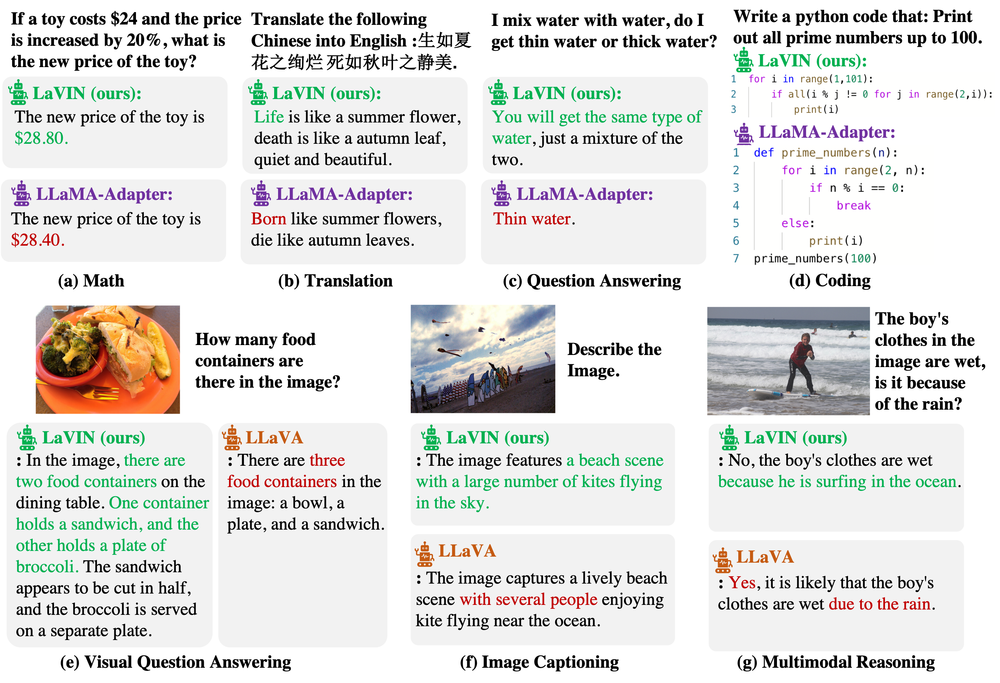

---

This repository contains the implementation of the following paper:
> **Cheap and Quick: Efficient Vision-Language Instruction Tuning for Large Language Models** 
>  Anonymous Authors

In this work, we propose a novel and affordable solution for vision-language instruction tuning, namely Mixture-of-Modality Adaptation (MMA). 
Particularly, MMA is an end-to-end optimization regime, which connects the image encoder  and LLM via lightweight adapters.   Meanwhile, we also   propose a novel routing algorithm in MMA, which can   help the model automatically shifts the  reasoning paths  for single- and multi-modal instructions.  Based on MMA, we develop a large vision-language instructed model called LaVIN, which demonstrates superior training efficiency and  better reasoning ability  than existing multimodal LLMs in various instruction-following tasks.

---

<div  align="center">    

</div>

## News 
- We update the training and evaluation scripts  for COCO captioning, VQAv2, TruthfulQA and MME benchmark.

## Contents
- [Setup](#setup)
- [Fine-tuning](#fine-tuning)

## Setup
### Install Package 
```bash
conda create -n lavin -y python=3.8
conda activate lavin

# install pytorch
conda install pytorch cudatoolkit -c pytorch -y

# install dependency and lavin
pip install -r requirements.txt
pip install -e .
```
### Data Preparation
- For ScienceQA, please prepare the dataset from the [official repo](https://github.com/lupantech/ScienceQA).
- For Multimodal Chatbot, download the images in _train2014_ split from [MSCOCO](http://images.cocodataset.org/zips/train2014.zip).  The prepared 52k text-only and 158k text-image instruction-following data can not be released, and author information will be leaked on download links.
- Obtain the weights of LLaMA from [this form](https://forms.gle/jk851eBVbX1m5TAv5)  (official) or Download [LLaMA-7B](https://huggingface.co/nyanko7/LLaMA-7B/tree/main) and [LLaMA-13B](https://huggingface.co/TheBloke/llama-13b) from HuggingFace (unofficial).
After that, the file structure should look like:
```
../data
|-- problem.json
|-- pid_splits.json
|-- captions.json
|-- all_data.json
|-- images
    |-- train2014
    |-- train
    |-- val
    |-- test
|-- weights
    |-- tokenizer.model
        |--7B
            |-- params.json
            |-- consolidated.00.pth
        |--13B
        ......
```
## Fine-tuning
### ScienceQA
Reproduce the performance of LaVIN-7B on ScienceQA (~1.4 hours on 8x A100 (80G)).
```bash
bash ./scripts/finetuning_sqa_7b.sh
```
Reproduce the performance of LaVIN-13B on ScienceQA (~2 hours on 8x A100 (80G)).
```bash
bash ./scripts/finetuning_sqa_13b.sh
```
### MultiModal ChatBot
Fine-tune LaVIN-13B on 210k instruction-following data (~ 75 hours with 15 epochs and ~25 hours with 5 epochs on 8x A100 (80G) )
```bash
bash ./scripts/vl_instruction_tuning_13b.sh
```
To train on fewer GPUs, you can reduce the number of gpus in the scripts and increase gradient accumulation via ```--accum_iter``` to guarantee the total batch size of 32. Setting  ```--gradient_checkpointing``` in the scripts will reduce the requirements of GPU memory.
**Note that the performance may drop if the batch size per gpu is less than 4.** We are figuring out the reason.
 
## Examples
<div  align="center">    

</div>
